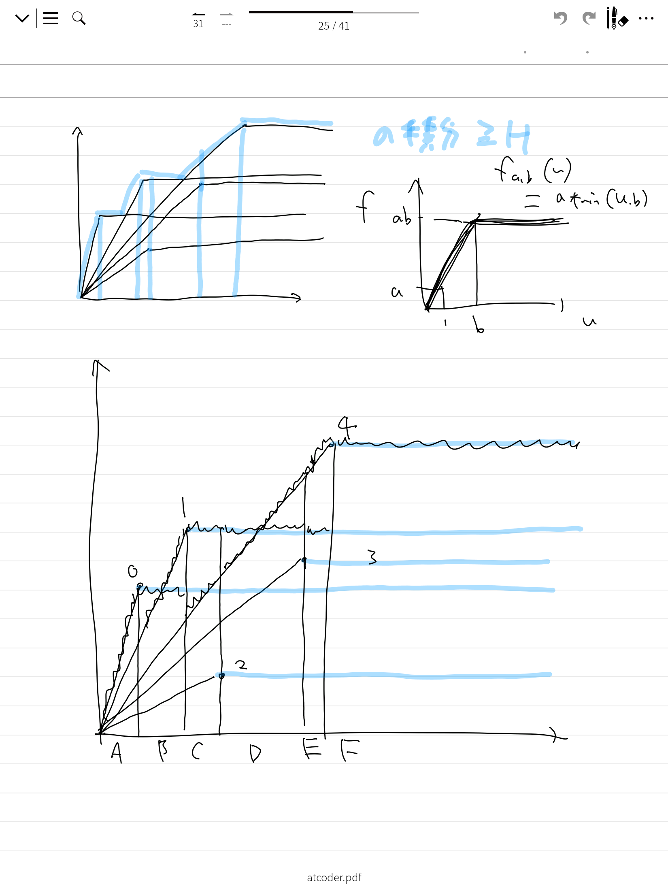

# i damage over time
すごい苦戦している。
## 問題
0-indexed で考える。
問題として次のような感じになる。
- $H: NN$, $N: NN$, $t: [NN; N]$, $d: [NN; N]$ が与えられる。
- $n: NN$, $C:[NN; n]$ ごとに次のように処理を行う。
    - $0$ ターン目のはじめ体力を $H$ とする。
    - $i in 0..n$ ターンごとに $c = C[i]$ について $c$ 番目の呪文を発動し、効果は $t[i]$ ターン続く。
    - $i in 0..n$ ターン目に発動している呪文を全て（番号の重複ありで）求め、 $j$ 番目の呪文が発動していれば体力から $d[j]$ を減算する。
- 求めるのは体力が $0$ 以下となるような最小の $n$ である。
## 求める式の書き換え
### 概要
あるターンに $i$ の呪文を唱えたとき、戦闘がちょうど $k$ だけ継続すれば与えるダメージは $d[i] * k$ と書ける。
どれぐらい戦闘が継続するかを中心に考えることで、
あるターンにどの呪文を唱えるべきかは、それが終了から何ターン目であるかに依存して決まることがわかる。
（開始からのターン数でないことが重要なポイント。）
もとめる値は次のようになる。
`min {n : NN | sum_{u in 0..=n} max_{k in 0..N} d[k] * min(u, t[k])}`
`td` をうまくカットしつつ適当にソートすることで、
$d'[i]$ については減少し、 $t'[i]$ については増加するように $d'[..] subset d[..]$ と $t'[..] subset t[..]$ をとる。

### sum max への書き換え
問題の設定を形式的っぽく書くとこんな感じ？
```
fn sum_damage(td: [NN; N], C: [NN; n]) -> NN {
    let mut s = 0;
    let mut v: Vec<(NN, NN)> = [];
    for i in 0..n {
        v.push((t[i], d[i]))
        for (&mut t, &d) in &mut v {
            s += d;
            t -= 1;
        }
        v.retain(|i| t[i] != 0)
    }
    s
}
```
で求めるのは、
```
min { C.len() | sum_damage(td, C) >= h}
```
ところで、これのプログラムの部分を見ると、 `for` の部分をもっと簡単に書くことができるとわかる。

```
fn sum_damage2(td: [NN: N], C: [NN; n]) -> NN {
    sum_{i in 0..n} d[C[i]] * min(n - i, t[C[i]])
}
```
今、 $C$ を動かすわけだが、 $n: NN$ を固定すれば、 $i in 0..n$ に対して `fn sum_damage2` を最大化するには $k(n, i) = argmax (k in 0..N |-> d[k] * min(n-i, t[k]))$ を $i$ 番目に唱えればよい。
つまり、 $C: [NN; n]$ に対して `sum_damage2(td, C) <= sum_damage2(td, [k(n, 0), ..., k(n, n-1)])` である。
だから求める値は
```
min { n | sum_damage2(td, [k(n, 0),...,k(n, n-1)]) = sum_{i in 0..n} d[f(n, i)] * min(n - i, t[f(n, i)]) >= h }
```
さらに観察すると、 $k(u) = argmax k in 0..N |-> d[k] * min(u, t[k])$ をとることで $k(n, i) = k(n - i)$ と書ける。
よって整理すると（その際に $n-i= u$ としつつ $u = 0$ も入れれば
```
min { n | sum_{i in 0..=n} d[k(i)] * min(u, t[k(i)])
                           ^^^^^^^^^^^^^^^^^^^^^^^^^ = max_{k in 0..N} d[k] * min (u, t[k])}
```

### 図による説明

ここで $u |-> d[k] * min(u, t[k])$ が黒線であり、 $u |-> max_{k in 0..N} d[k] * min(u, t[k])$ がグラフの上を覆う青線である。
$sum_{u in 0..=n} max_{k in 0..N} d[k] * min(u, t[k])$ は積分に対応する。
以降では、
`f(td) = x: NN |-> max_{k in 0..td.len()} d[k] * min(x, t[k])`
とする。
求めるものは `sum_{u in 0..=n} f(td)(u) >= h` となる最小の `n` である。

### td の整形
グラフを見てもわかるように、 $(t,d) in td[..]$ の中にはあってもなくても $max_{} \cdots$ の部分には関係しない。
つまり、 `i != j` であって `d[i] < d[j], d[i] * t[i] <= d[j] * t[j]` となっている場合には `j` を除いてよい。
また `td` の順序は関係ないため、以降の利便性を考えて $d$ が大きい順に並べられているものとする。

## 計算方法
バグったので一気にではなく適当に切り分けることにする。
以降では td は上のようにして成形されたものとする。
よって、 td は `i < j` ならば `t[i] < t[j]` かつ `d[i] > d[j]` かつ `d[i] * t[i] < d[j] * t[j]` となっている。
今 `f(x: NN) -> NN := max_{k in 0..N} d[k] * min(x, t[k])` と書いておく。
ここで注意すべきところとして、
`td`　の形から、
`t[i] <= x < t[i+1]` のとき、 `f(td)(x) = max(d[i] * x, d[i+1] * t[i+1])` と書ける。
（つまり先ほどの図のグラフを張っているところだけちょうどとってきた。）
あとは `integrate((a, b), (l, r)) := sum_{u in l..r} max(a * u, b)` と定めれば、これは式を変形して $O(1)$ で求めることができ、
累積的に積分を評価すればよい。
（デバッグのしやすさを考えて構造体を作ったが、そうしないほうがいいかも）
